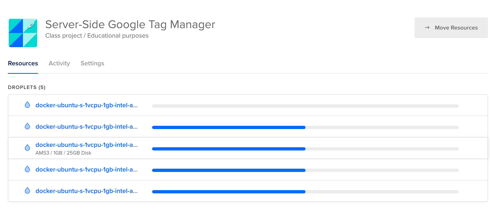
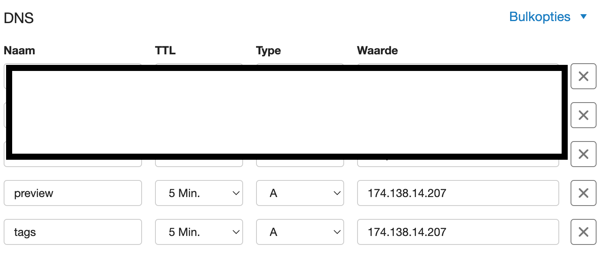
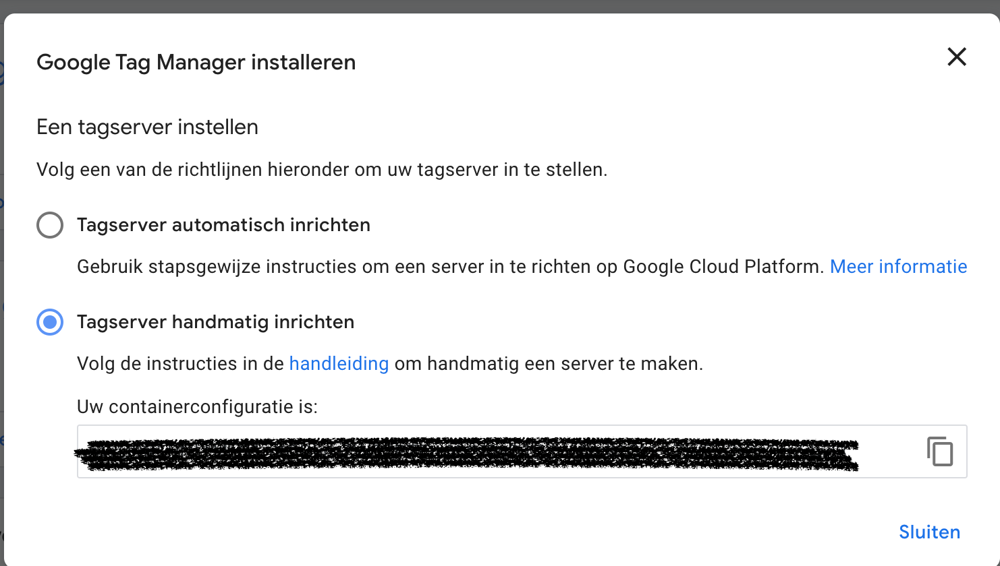

# Manual sGTM setup on a Docker Swarm cluster

This template can be used to setup server-side Google Tag Manager (sGTM) using a cluster of Docker Swarm nodes (hosted 
on a vps such as EC2 or a droplet on [Digital Ocean ](https://digitalocean.com/)). This is setup is meant as a rudimentary 
starting point to self-host sGTM. This setup will require an own domain name.

## Usage example
We will use Digital Ocean as an example. Digital Ocean offers an relative easy interface to test this setup. You could also opt for
(even) cheaper alternatives, such as [Contabo](https://contabo.com/en/). AWS EC2 instances are also a great option when using spot instances.

1. In Digital Ocean we create several VPS ('droplets') within the same VPC (select the option when creating your 'droplets' 
in Digital Ocean). This example is tested with 5 small VPS: 1 GB / 1 Intel vCPU / 25 GB. Your could also opt for 2-3 'droplets' 
with more capacity. Some specific Digital Ocean related note which allow to safe some time:
- (i) Don't forget to select the D**ocker Image** under 'Marketplace' section when creating your VPS (ellse you need to 
install this yourself - [see here](https://docs.docker.com/desktop/install/ubuntu/))!
- (ii) Add a SSH key to your VPS! See [this page](https://docs.digitalocean.com/products/droplets/how-to/add-ssh-keys/) 
if your don't know how.


2. Next, we ssh into one of the VPS. Like so (replace IP with one of the droplets you just created):
   ```bash 
    $ ssh root@174.138.14.207
   ```
3. We will now create the 'manager node' of the Docker Swarm. Setup the Firewall of the host you have ssh'd into like so:
    ```bash 
    $ ufw allow 22/tcp
    $ ufw allow 2376/tcp
    $ ufw allow 2377/tcp
    $ ufw allow 7946/tcp
    $ ufw allow 7946/udp
    $ ufw allow 4789/udp
   ```
   Afterwards, reload UFW:
    ```bash 
    $ ufw reload
   ```
   Run the following command to create a new swarm ([more info, here](https://docs.docker.com/engine/swarm/swarm-tutorial/create-swarm/)):
   ```bash 
   $ docker swarm init --advertise-addr <MANAGER-VPC-IP>
   ```
   **Note**: ManagerVPC-IP = found [here in Digital Ocean](https://cloud.digitalocean.com/networking/vpc) in your VPC next to the public ip- e.g. 10.133.0.2
    This will generate a command with a token which needs to be run in other hosts, therefore save it in your notepad for later.
4. The other hosts will function as 'worker nodes' (as opposed to the manager node). Therefore, you need to Repeat the 
following steps for each of the other hosts. First you ssh into the host: 
    ```bash 
    $ ssh root@206.189.98.48
   ```
   Next, set up the firewall:
    ```bash 
    $ ufw allow 22/tcp
    $ ufw allow 2376/tcp
    $ ufw allow 7946/tcp
    $ ufw allow 7946/udp
    $ ufw allow 4789/udp
   ```
   Afterwards, reload UFW:
    ```bash 
    $ ufw reload
   ```
   Run the command which was generated earlier and which you saved in your notepad.
   ```bash 
   $ docker swarm join --token <your-join-token> <private-ip-of-manager-node>:2377
   ```
5. Now you need to set up your DNS and point two A records to the public ip address of your 'master node' (the one you ssh'd
into in step 2). The A records shall be two subdomain (of your website...) which point to the 'tagging' and 'preview' server.
Example records ('preview.example.com' and 'tags.example.com'):

6. Now you need to clone this repo onto your master node and create your own .env file containing your subdmains and sGTM 
configuration.
   ```bash 
   $ git clone https://github.com/frankdevlabs/sgtm-manual-server.git
   ```
   Then we create the .env file like so:
   ```bash
    $ cd sgtm-manual-server
    $ cp .env.template .env
    $ vim .env
   ```
   Add your subdomains and sGTM configuration (which can be found/copied when setting up your sGTM container 
[here](https://tagmanager.google.com/).) and save the file.

7. Almost there. Now, while still in the 'sgtm-manual-server' directory, run the following command:
   ```bash 
    $ docker stack deploy -c <(docker-compose config) sGTM
   ```
   
If everything goes well.. then your very own sGTM cluster should start working. Sometimes it takes a while for the dns records 
to kick in. Test it by going to the path '/healthz' on your domain(s). More information [here](https://developers.google.com/tag-platform/tag-manager/server-side/manual-setup-guide)

## About this setup in production
This setup is more than fine for a small website, but we can do better... I advice a more resilient solution 
in production for websites for which sGTM uptime is business critical. Such a setup includes a CDN (e.g. Cloudflare or 
Cloudfront) and/or load balancer to handling proxying to your sGTM container (instead of Caddy). Alternatively you
could pay for solution such as [stape.io](https://stape.io) (est. 20 dollar) which is definitely cheaper than the 'Automatic' 
solution of GCP (est. 120 dollar). 
